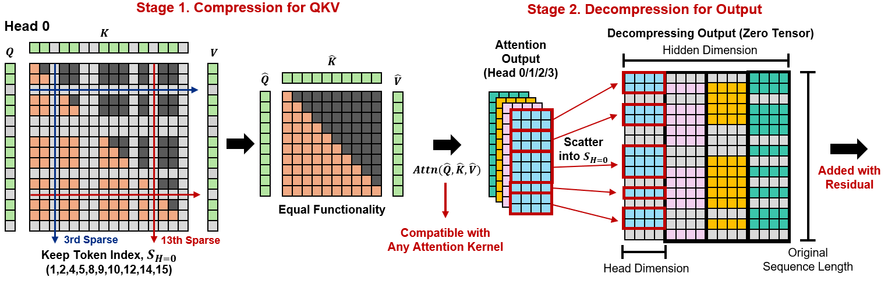

<h1 align="center">Token Sparse Attention: Efficient Long-Context Inference with Interleaved Token Selection</h1>

<div align="center">
    
[](https://arxiv.org/abs/2602.03216)
[](https://github.com/dongwonjo/Token-Sparse-Attention)

</div>

<div align=center>

</div>
</br>

This is the official repository of **"Token Sparse Attention: Efficient Long-Context Inference with Interleaved Token Selection"**.
Token Sparse Attention is a lightweight and dynamic token-level sparsification mechanism for efficient long-context inference in large language models.
Token Sparse Attention performs per-head token selection at each layer and scatters the attention output back into the original sequence dimension. 
This reversible design allows token relevance to be re-evaluated across all layers and heads without permanently discarding any tokens. 
It is fully compatible with existing dense and sparse attention kernels, enabling seamless composition with prior acceleration methods.
Experimental results show that Token Sparse Attention consistently improves the accuracy–latency trade-off, achieving up to ×3.23 attention speedup at 128K context with less than 1% accuracy degradation.

## Usage
### 1. Installation
Installation with the requirements package.
```
conda create -n token_sparse python=3.10 -y
conda activate token_sparse
cd Token-Sparse-Attention
./install.sh
```

### 2. Quick Start
Inference with Token Sparse Attention methods and evaluation and speedup benchmark.

```
# Run benchmark
./scripts/benchmark_attention.sh
./scripts/benchmark_prefill.sh

# Run Evaluation
./scripts/eval.sh
```
## Acknowledgements
We have integrated the baseline methods ([FlexPrefill](https://github.com/ByteDance-Seed/FlexPrefill), [Minference](https://github.com/microsoft/minference), [X-Attention](https://github.com/mit-han-lab/x-attention)) for experiments and evaluations.

Thanks to their open-source contributions.

## Citation
If you use the Token Sparse Attention approach in your research,  please consider citing:

```
@article{token_sparse,
  title={Token Sparse Attention: Efficient Long-Context Inference with Interleaved Token Selection},
  author={Dongwon Jo, Beomseok Kang, Jiwon Song, Jae-Joon Kim},
  journal={arXiv preprint arXiv:2602.03216},
  year={2026}
  }
```
